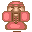

# [NPC](../src/element/NPC/index.ts)

精灵，商人都属于此类，这类可以给英雄一些信息，以及特殊操作，所以单独拎出来

### [Merchant 商人](../src/element/npc/merchant.ts)

- : MerchantMinExp
- : MerchantExp
- : MerchantKey

> TODO: 后面添加一个属性, 大小商人直接使用属性控制就好

### [Spirit 精灵](../src/element/npc/spirit.ts)

- : spirit
