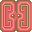
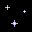
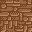
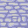

# 地图

通过循环地图`行列属性`进行渲染

## 实现

提取一个类为 `MapItem`，其他类继承该类,这里可以设置一些公共属性

```javascript
import { CommonProperty } from "../common/CommonProperty";
import { MapTiles, type MapItemProperty } from "@/constants";
import type { PositionType } from "@/typings/constants";

export class MapItem extends CommonProperty {
  Name: string = "";

  constructor(
    id: MapTiles,
    property?: MapItemProperty,
    position?: PositionType
  ) {
    super(id, position);
    if (property) {
      this.Name = property.Name;
    }
  }
}
```

> 因为`CommonProperty`默认是无法通过,然后加上地图元素大部分都不可破坏,所以这里的`execute`方法可以先不实现

### 特殊交互

判断`英雄`是否拥有·`破冰镐`·`破墙镐`·`门钥匙`·等道具，如果有就可以破坏地形,否则按原先规则行走

## 地图元素 【[Map](../src/element/map/index.ts)】

### [Door 门](../src/element/map/door.ts)

- : DoorRed
- : DoorBlue
- : DoorYellow

### [Magma 熔岩](../src/element/map/magma.ts)

- : Magma

### [Shopping 商店](../src/element/map/shopping.ts)

- : ShoppingMin
- : Shopping

> 作为地图中比较特殊的一类，可以让英雄进行购买，但是其占的位置较大，所以需要使用转发做出特殊处理
>
> TODO: 后面添加一个属性, 大小商店直接使用属性控制就好

### [Staircase 楼梯](../src/element/map/staircase.ts)

- : StaircaseUp
- : StaircaseDown

### [star 星辰](../src/element/map/star.ts)

- : Star

### [Wall 墙](../src/element/map/wall.ts)

- : Wall
- : CementWall
