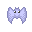

# [角色](../src/element/role)

角色：一切可进行对战的对象，英雄，怪物

## 公共角色类

```JavaScript
import { CommonProperty } from "@/element/common/CommonProperty";
import { RoleTiles } from "@/constants";
import type {
  CommonFuncMap,
  PositionType,
  RoleProperty,
} from "@/typings/constants";
import type { Hero } from "./hero";

export class Role extends CommonProperty {
  Name: string = "";
  HP: number = 0;
  MP: number = 0;
  XP: number = 0;
  Gold: number = 0;
  DEF: number = 0;
  ATK: number = 0;

  constructor(id: RoleTiles, property?: RoleProperty, position?: PositionType) {
    super(id, position);
    this.initValue(property);
  }

  initValue(property?: RoleProperty) {
    if (property) {
      this.Name = property.Name;
      this.HP = property.HP;
      this.ATK = property.ATK;
      this.DEF = property.DEF;
      this.XP = property.XP;
      this.Gold = property.Gold;
      this.MP = property.MP;
    }
  }

  execute(_hero: Hero, _commonFuncMap: CommonFuncMap) {
    return { flag: false, isFight: true };
  }
}
```

> 该类主要提供基础属性,以及数值的初始化操作
>
> - HP: 血量
> - MP: 魔法值【暂时不需要】
> - XP: 经验值
> - Gold: 金币
> - DEF: 防御力
> - ATK: 攻击力

### [英雄](../src/element/role/hero.ts)

#### 自带属性

- Level: 等级
- hasFlying: 是否拥有飞行器
- hasBook: 是否拥有怪物手册
- hasIcebreakerScript: 是否拥有破冰镐
- hasBrickBreaker: 是否拥有破墙镐
- key: 钥匙的数量，为对象

#### 特殊收益

提升等级：

- HP + 1000
- ATK + 7
- DEF + 7

打败怪物：

- XP + 怪物 XP
- Gold + 怪物 Gold

### 怪物

### [bat 蝙蝠](../src/element/role/bat.ts)

- : Bat

### [knight 武士](../src/element/role/knight.ts)

- : Knight

### [magician 魔法师](../src/element/role/magician.ts)

- : Magician

### [skeleton 骷髅人](../src/element/role/skeleton.ts)

- : Skeleton
- : SkeletonSoldier

### [slime 史莱姆](../src/element/role/slime.ts)

- : SlimeGreen
- : SlimeRed
- : SlimeBlack
