# 道具元素 【[Prop](../src/element/prop/index.ts)】

道具分为两类，一类常驻型，一类消耗型

- 常驻型道具：破冰镐，破墙镐，飞行器，怪物手册
- 消耗型道具：药瓶，钥匙，宝石
- 消耗但是状态栏常驻型：剑，盾 【这个可以放在消耗型道具中】

### [Drug 药瓶](../src/element/prop/drug.ts)

- 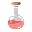: DrugMini
- 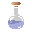: DrugMini
- 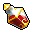: DrugMiddle
- 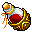: DrugMax

### [Gemstone 宝石](../src/element/prop/gemstone.ts)

- 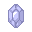: GemstoneBlue
- 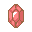: GemstoneRed
- 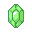: GemstoneGreen

### [Sword 武器](../src/element/prop/sword.ts)

- : Sword
- 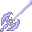: SwordBig
- 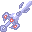: SwordGod

### [Key 钥匙](../src/element/prop/key.ts)

- 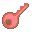: KeyRed
- : KeyBlue
- : KeyYellow

### [Use 便捷道具](../src/element/prop/use.ts)

- 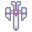: Book
